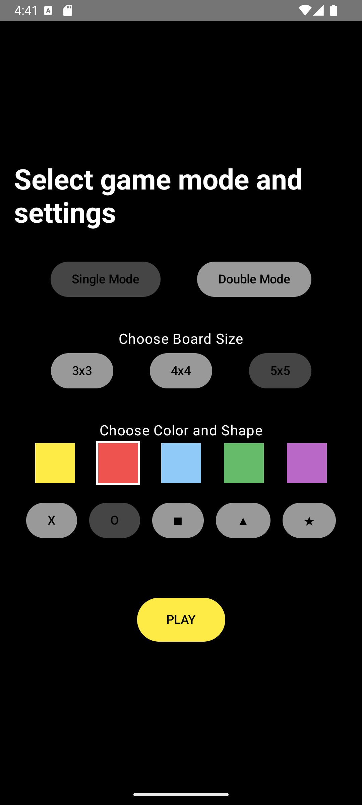

# TicTacToe

Prosta aplikacja mobilna do gry w kółko i krzyżyk z obsługą trybów jednoosobowego i dwuosobowego. 
Aplikacja stworzona w Kotlinie z wykorzystaniem Jetpack Compose.

---

## Funkcje
- Tryb jednoosobowy (gra z komputerem) i dwuosobowy.
- Możliwość wyboru rozmiaru planszy (3x3, 4x4, 5x5).
- Personalizacja kolorów i kształtów graczy.

---

## Struktura projektu
1. **MainActivity.kt**
   Zarządzanie ekranami aplikacji.

2. **StartScreen.kt**
   Ekran konfiguracji gry (wybór trybu, rozmiaru planszy, kolorów i kształtów graczy).

3. **GameScreen.kt**  
   Ekran rozgrywki. Obsługa logiki gry, zmiana gracza oraz sprawdzanie wygranej.

4. **ResultScreen.kt**  
   Ekran wyników z opcją powrotu do ustawień lub rozpoczęcia nowej gry.

5. **Folder ui.theme**
    - **Color.kt** – Definicje kolorów.
    - **Theme.kt`** – Ustawienia motywu aplikacji.
    - **Type.kt** – Definicje stylów tekstu.

---

## Jak uruchomić?
1. Sklonuj projekt:
   ```bash
   git clone 
   ```
2. Otwórz projekt w Android Studio.
3. Uruchom aplikację na emulatorze lub urządzeniu fizycznym.

---

## Przykładowe zrzuty ekranu 
- Ekran konfiguracji gry

- Rozgrywka w toku  

- Ekran wyników

 

---

**Autorki:** Klaudia Marzec, Kinga Foksińska
